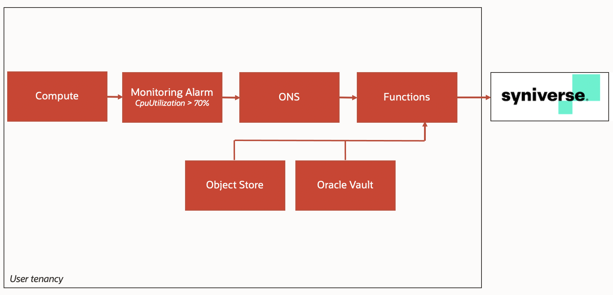

# Integrate OCI alerts with Syniverse SMS

## Introduction

In this tutorial, you'll create an alert based on CPU utilization and configure [Syniverse](https://developer.syniverse.com) to send an alert when it reaches the defined threshold. 



It uses OCI alarm to trigger Oracle notification service; that is, for generated alerts,  it will trigger Oracle functions to call Syniverse API to send the SMS.

Everything is customizable, and by following these steps, you can use your Syniverse keys to send an SMS alert.

Object Storage stores a file with the target phone numbers, and Oracle Vault is used to store the API keys.

## Step 1: Create a Syniverse Account and API key

1. Go to [https://developer.syniverse.com/home.html](https://developer.syniverse.com/home.html#home) and create an account.

2. Sign in to your Syniverse account and go to menu **Applications**, and click **Create New**

3. Enter the following:

    * **Application Name**: oci

    * **Description**: Real-time SMS with OCI Alert or OCI logs

    * **Account:** Choose your initial account

    Refer to this example.

    

4. After creating the Application, click on the Application name and expand the **Auth Keys** to see the API details. We will use this info on the Oracle Function and Vaults


    

For more info check [here](https://sdcsupport.syniverse.com/hc/en-us/articles/236185587-SCG-Quick-Start-guide).


## Step 2: Create an OCI compartment

1. **Login** to the OCI Console as an Administrator

2. Go to **Menu** \> **Identity** \> **Compartments**

3. Click the **Create Compartment** button

4. Enter the following:
    ** **Name**: my-compartment
    * **Description**: My Compartment
    * Select a **Parent Compartment**(If you want to make it a child of an existing compartment, select the relevant parent compartment, otherwise accept the default root container)

5.  Click **Create** Compartment.

6.  The new compartment is now listed on the compartments dashboard, and you can create resources within.


## Step 3: Create an Oracle Vault

1. Go to **Menu** > **Security** > **Vault**

2. Select the compartment **my-compartment** that you created earlier.

3. Click the **Create Vault** button.

4. Enter the following:
    * **Name**:  syniverse

5. Click **Create Vault** button to save.

6. Click **syniverse** that you just created.

7. Click **Keys** link under Resources. 

8. Click the **Create Key** button.

9. Enter a **Name** for the key; e.g. **syniverse_token**.

10. Select **256 bits** from the **Key Shape**.

11. Click the **Create Key** button to save.

12. Click **Secrets link** under **Resources**.

13. Click **Create Secret**.

14. Enter the following:
    * **Name**:  secret_token
    * **Description**:  My Secret
    * **Encryption Key**:  select **syniverse_token** created earlier
    * **Secret Contents**:  here you should add the **Access token** from Syniverse created in step 1


15. Click the **Create Secret** button and then click on the secret **my-secret** that you have created.

17. **Copy** the secret **OCID** to be used next.


## Step 4: Create a Dynamic group

You will need to create two dynamic groups, one for an Oracle Vault and one for the Oracle Function read Object Store.

1.  Go to **Menu** > **Identity** > **Dynamic Groups**

2.  Click the **Create Dynamic Group** button.

3.  Enter the following:
    * **Name**:  my-secret-group
    * **Description**: My Secret Dynamic Group
    * **Rule**:  any {instance.compartment.id = ‘**ocid_compartment**’}

    **NOTE**: **ocid_compartment** is the ocid copied from my-compartment created earlier.

4.  Click the **Create Dynamic Group** button to save.

    1.  Go to **Menu** > **Identity** > **Dynamic Groups**
    2.  Click the **Create Dynamic Group**button
    3.  Enter the following:
        * **Name**:  fn-obj-store-list
        * **Description**: My Secret Dynamic Group
        * **Rule**:

        ```
        ALL {resource.type = 'fnfunc', resource.compartment.id = '**ocid_compartment**'}
        ```
    **NOTE**: **ocid_compartment** is the ocid copied from my-compartment created earlier.

4.  Click the **Create Dynamic Group** button to save.


## Step 5: Create a Policy

We will create two policies:

1. Go to **Menu** \> **Identity** \> **Policies**
2. Click the **Create Policy** button
3. Enter the following:
    * **Name**: fn-obj-store-list-policy
    * **Description**: My Policy
    * **Statements**: on **Policy Builder** click in **Cutmomize(advanced)**
       ```
       allow dynamic-group fn-obj-store-list to manage
       all-resources in compartment my-compartment
       ```
4. Click the **Create** button to save.

    1. Go to **Menu** \> **Identity** \> **Policies**
    2. Click the **Create Policy** button.
    3. Enter the following:
       * **Name**: fnpolicy
       * **Description**: My Policy
       * **Statements**: on **Policy Builder** click in
       * **Cutmomize(advanced)**
         ```
         allow service FAAS to use virtual-network-family in tenancy
         allow service FAAS to read repos in tenancy
         ```

4. Click the **Create** button to save.


## Step 6: Create an Object Store

First, you need to create a Bucket.

1. Go to **Menu** > **Core Infrastructure** > **Object Storage**

2. Select the compartment **my-compartment** created earlier

3. Click **Create Bucket**

4. In the **Create Bucket** dialog box, specify the attributes of the bucket:

   * **Bucket Name:**syniverse-phone we can leave all other values as default values.

5. Click **Create Bucket**

Now you need to upload a file with the phone number. Create a local file called **numbers.txt **and add the phone number that you want to use for your case.

To upload files to your bucket using the Console:

1. From the Object Storage Details screen, click the bucket name to view its details
2. Click **Upload Objects**
3. Select the **numbers.txt** file to upload
4. Click **Upload Objects**
    The selected objects are uploaded. Click **Close** to return to the bucket.


## Step 7: Create a Virtual Cloud Network (VCN)

1. Go to **Menu** > **Core Infrastructure** > **Networking** > **Virtual Cloud Networks**.

2. Select the compartment **my-compartment** created earlier

3. Click **Start VCN Wizard**.

4. Choose **VCN with internet connectivity**and click **Start VCN Wizard**.

5. Add a VCN name and leave all values default.

6. Click **Next** and confirm to create the VCN


## Step 8: Create an Oracle Function

1. Go to **Menu** > **Developer Service** > **Functions**

2. Select the compartment **my-compartment** created earlier

3. Click **Create Application **and add application details.

4. Pick your Compartment, VCN, and Subnet created earlier

5. Launch Cloud Shell

6. Use the context for your region

    ```
    fn list contextfn list context
    fn use context us-phoenix-1
    ```

7. Update the context with the function's compartment ID

    ````
    fn update context oracle.compartment-id <**compartment-id**>
    ````

8. Update the context with the location of the Registry you want to use

    ```
    fn update context registry phx.ocir.io/<tenancy_name>/[YOUR-OCIR-REPO]
    ```
    Replace phx with the three-digit region code

9.  Click on **Generate an Auth Token**
    Log in to the Registry using the Auth Token as your password

    ```
    docker login phx.ocir.io <-- Replace phx with the three-digit region code
    ```

    You are prompted for the following information:
    * Username: **tenancyname**/**username**
    * Password: Create a password

    **Note**: If you use Oracle Identity Cloud Service, your username is **tenancyname/oracleidentitycloudservice/username**.

10. Generate a 'hello-world' boilerplate function

    ```
    fn init --runtime python syniverse
    ```

    This function will create a folder "syniverse" with a simple fn python
    example.

    Replace the content of the files with the code below.

    You can get the full code [here](https://github.com/oracle-quickstart/Integrating-OCI-alerts-and-logs-with-Syniverse-SMS)

    The config part contains the Object Store configurations, namespace, bucket name and file name, and the Syniverse configurations, Syniverse endpoint URL, and the toke for authentication that we stored in the vault in Step 3.
   

11. Create the app

     ```
     fn create app syniverse --annotation oracle.com/oci/subnetIds= '["ocid1.subnet.oc1.phx.aaaaxxxxxxxxxxx"]'
     ```

    Change the subnetIds for your subnet OCID.

12. Deploy your function

      ```
      fn -v deploy --app syniverse
      ```


## Step 9: Create Compute instance

1. Go to **Menu** \> **Compute** \> **Instances** 
2. Click **Create Instance** button
3. Use the following example:
    * **Name**:  instance-syniverse
    * **Image**:  \<leave default Oracle Linux 7.8 or select Oracle Linux 6.10\>
    * **Change Shape**:  \<pick your shape\>
    * **Configuring networking**:  pick your VCN, Subnet Compartment, and Subnet created earlier
    * **Add SSH keys**: Add your ssh rsa public key

4. Click **Create** button to create the instance.

Now we need to install some tools to do the stress test.

1. SSH to your compute instance

    ```
    ssh -i ~/path/for/ssh-key.key opc@your_machine_ip
    ```

2. Install **stress**

   ```
   sudo yum install stress
   ```

3.  Run the command to start the stress

    ```
    stress --cpu 20 --io 4 --vm 4 --vm-bytes 1024M --timeout 60s
    ```


## Step 10: Create Oracle Notification Service

1. Go to **Menu** \> **Application Integration** -\> **Notifications**

2. Click**Create Topic.**

3. Use the following example:
    *  **Name**:  syniverse
    *  **description**: syniverse

4. Click **Create Topic**

5. Your topic is now ready for subscriptions

6. Click on your topic

7. Click **Create Subscription**

8. Use the following example:
    * **Protocol**:  function
    * **Function Compartment**: Select the compartment
    * **my-compartment** created earlier
    * **Function Application**: syniverse
    * **Function**: syniverse

9.  Click **Create**

You can create a subscription for E-mail and Slack as well.


## Step 11: Create OCI Alert

1. Go to **Menu** \> **Monitoring \> Alarm definitions**

2. Click the **Create Alarm** button

3. Use the following example:
    * **Alarm Name**:  syniverse
    * **Alarm severity**:  Critical
    * **Alarm body**: OCI Alarm: syniverse. CpuUtilization: 90

4. On **Metric Description**
    * Choose your **compartment**
    * **Metric namespace** oci_computeagent
    * **Metric name**CpuUtilization
    * **Interval**1m
    * **Statistic**Max

5. On **Metric dimensions**
    * **Dimension name**resourceDisplayName
    * **Dimension value** instance-syniverse

6. On **Trigger rule**
    * **operator** greater than
    * **Value**90
    * **Trigger delay minutes** 1

7. On **Notification**
    * **Destination service**notification service
    * Choose your **compartment**
    * **Topic**syniverse

8. Click **Save Alarm**


## Conclusion

This tutorial shows how Oracle Cloud Infrastructure and Syniverse customers can configure a low-overhead and highly scalable solution for creating and send SMS from Oracle Cloud Infrastructure alerts using Oracle Functions.

## Acknowledgements

**Author** - Igor Aragao de Souza

## Learn More

Explore other labs on [docs.oracle.com/learn](https://docs.oracle.com/learn) or access more free learning content on the [Oracle Learning YouTube channel](https://www.youtube.com/user/OracleLearning). Additionally, visit [education.oracle.com/learning-explorer](https://education.oracle.com/learning-explorer) to become an Oracle Learning Explorer.

For product documentation, visit [Oracle Help Center](https://docs.oracle.com).
